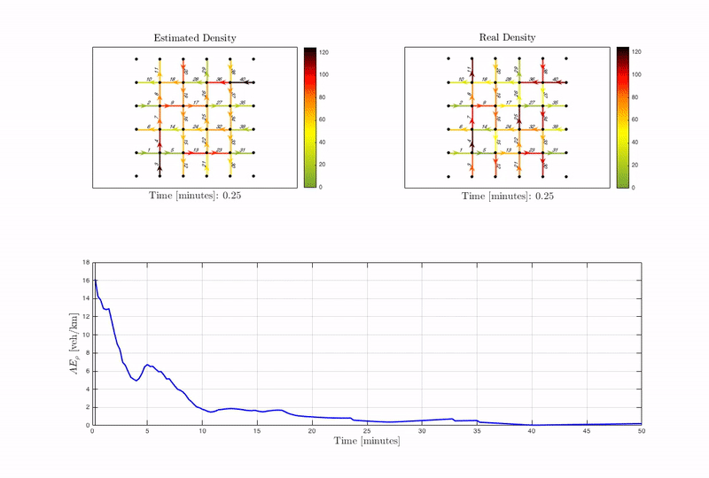

**| [Overview](#overview) | [Structure](#structure) | [Launching simulations](#launching-simulations) | [External tools](#external-tools) | [License](#license) | [Contact](#contact) |**

# Density reconstruction in urban traffic networks

## Overview 

This repository contains source code used to generate the example in *"Density and flow reconstruction in urban traffic networks using heterogeneous data sources"* by   [Andres Ladino](https://github.com/aladinoster), [Carlos Canudas-de-Wit](http://www.gipsa-lab.grenoble-inp.fr/~carlos.canudas-de-wit/), [Alain Kibangou](http://www.gipsa-lab.grenoble-inp.fr/~alain.kibangou/), [Hassen Fourati](http://www.gipsa-lab.grenoble-inp.fr/page_pro.php?vid=1442), and Martin Rodriguez. 

 

## Structure 

Launch the file `Main.m` in MATLAB in order to obtain the results. 

- `ManhattanGridConstruction.m`: Contains the creation of a traffic network type manhattan
-  `CellTransmissionModel.m`: Implements the traffic model 
- `Estimation.m`: Implements the estimation technique 

## Launching simulations 

In matlab launch [Main](Main.m). 

- `Time_Plot_Links_Animated.m` creates a video of the result 
- `Time_Plot_Links.m` & `Time_Plot_2D.m` are plotting tools 

## External tools

- MATLAB 2016

## License

These notebooks are licensed under [MIT License](https://github.com/aladinoster/density-reconstruction/blob/master/LICENSE.md)

## Contact 

If you run into problems or bugs, please let us know by [creating an issue](https://github.com/aladinoster/density-reconstruction/issues/new) an issue in this repository.